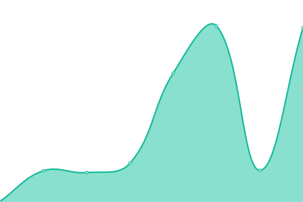
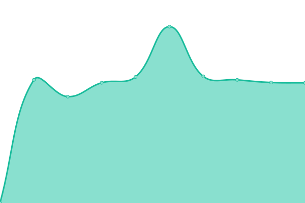
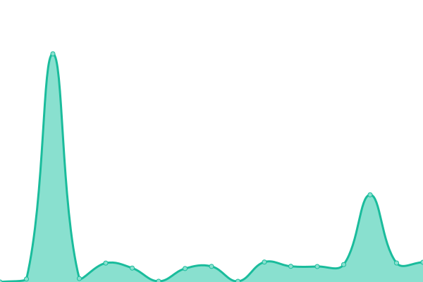

# [📈 Live Status](https://demo.upptime.js.org): <!--live status--> **🟧 Partial outage**

This repository contains the open-source uptime monitor and status page for [Upptime](https://upptime.js.org), powered by [Upptime](https://github.com/upptime/upptime).

With [Upptime](https://upptime.js.org), you can get your own unlimited and free uptime monitor and status page, powered entirely by a GitHub repository. We use [Issues](https://github.com/upptime/upptime/issues) as incident reports, [Actions](https://github.com/upptime/upptime/actions) as uptime monitors, and [Pages](https://demo.upptime.js.org) for the status page.

<!--start: status pages-->
<!-- This summary is generated by Upptime (https://github.com/upptime/upptime) -->
<!-- Do not edit this manually, your changes will be overwritten -->
<!-- prettier-ignore -->
| URL | Status | History | Response Time | Uptime |
| --- | ------ | ------- | ------------- | ------ |
|  [Google](https://www.google.com) | 🟩 Up | [google.yml](https://github.com/AmazonPython/upptime.github.io/commits/HEAD/history/google.yml) | 

 94ms
     
 | 

<a href="https://demo.upptime.js.org/history/google">100.00%</a>
    

|  [Wikipedia](https://en.wikipedia.org) | 🟩 Up | [wikipedia.yml](https://github.com/AmazonPython/upptime.github.io/commits/HEAD/history/wikipedia.yml) | 

 223ms
     
 | 

<a href="https://demo.upptime.js.org/history/wikipedia">100.00%</a>
    

|  [Hacker News](https://news.ycombinator.com) | 🟩 Up | [hacker-news.yml](https://github.com/AmazonPython/upptime.github.io/commits/HEAD/history/hacker-news.yml) | 

 334ms
     
 | 

<a href="https://demo.upptime.js.org/history/hacker-news">100.00%</a>
    

|  [Broken Site](https://thissitedoesnotexist.com) | 🟥 Down | [broken-site.yml](https://github.com/AmazonPython/upptime.github.io/commits/HEAD/history/broken-site.yml) | 

 0ms
     
 | 

<a href="https://demo.upptime.js.org/history/broken-site">100.00%</a>
    

|  [Luna Nova's Blog](https://lunanova.top) | 🟩 Up | [luna-nova-s-blog.yml](https://github.com/AmazonPython/upptime.github.io/commits/HEAD/history/luna-nova-s-blog.yml) | 

 1404ms
     
 | 

<a href="https://demo.upptime.js.org/history/luna-nova-s-blog">100.00%</a>
    

|  [Slug blog](https://slug.lunanova.top) | 🟩 Up | [slug-blog.yml](https://github.com/AmazonPython/upptime.github.io/commits/HEAD/history/slug-blog.yml) | 

 1538ms
     
 | 

<a href="https://demo.upptime.js.org/history/slug-blog">100.00%</a>
    

|  [BeepBeep](https://beepbeep.lunanova.top) | 🟩 Up | [beep-beep.yml](https://github.com/AmazonPython/upptime.github.io/commits/HEAD/history/beep-beep.yml) | 

 1320ms
     
 | 

<a href="https://demo.upptime.js.org/history/beep-beep">100.00%</a>
    

|  [Forum](https://forum.lunanova.top) | 🟩 Up | [forum.yml](https://github.com/AmazonPython/upptime.github.io/commits/HEAD/history/forum.yml) | 

 1175ms
     
 | 

<a href="https://demo.upptime.js.org/history/forum">100.00%</a>
    

|  [Hive Store](https://hive.lunanova.top/) | 🟩 Up | [hive-store.yml](https://github.com/AmazonPython/upptime.github.io/commits/HEAD/history/hive-store.yml) | 

 1704ms
     
 | 

<a href="https://demo.upptime.js.org/history/hive-store">100.00%</a>
    

<!--end: status pages-->

[**Visit our status website →**](https://demo.upptime.js.org)

## 📄 License

- Code: [MIT](./LICENSE) © [Upptime](https://upptime.js.org)
- Data in the `./history` directory: [Open Database License](https://opendatacommons.org/licenses/odbl/1-0/)
